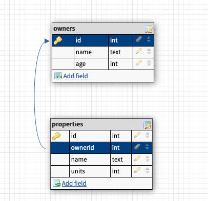
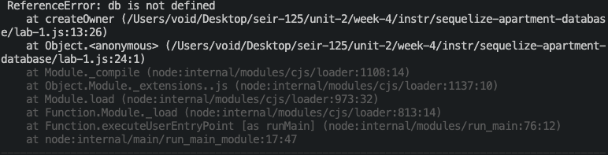

# Sequelize Apartments

We are going to do some more SQL apartment **CRUD** again, but this time, we are doing it *sequelize* style!

### Getting started

* Fork and clone this repo as normal
* You have to setup a node sequelize project to begin
* `index.js` can be used to take test your database and put code-along notes in
* Each part of the lab has a corresponding `.js` file for you to do your work in. 
* Add, commit, and push your changes when you finish each part
* Make a pull request!

## Setting up a node sequelize project

You will need to initialize a node project and setup sequelize with the sequelize CLI

### Starting a node project

The first thing to do in your project folder is to initilize node with the `npm init -y` command. 

Aftarwards make sure to create a .gitignore file that tells git not to track your node modules!

```bash
echo node_modules >> .gitignore
```

### Seting up sequelize

Now its time to set up the sequelize node package! 

If you don't have sequelize installed globally, you will need to install it along with the postgres dialect package. *Otherwise skip this step!* Run `npm i sequelize pg` to install the required packages.

To generate the boilerplate for a sequelize project, run `sequelize init`

The next step is to create the database we will use. Run `createdb sequelize_apartments`. Check to make sure it worked by starting up your `psql` shell and using the `\l` to list all the databases. 

Once your database is created, its time to update sequelize's config file. Set the development database to "sequelize_apartments" and the dialect to "postgres", then remove all of the other unnessasry junk.

```json
{
  "development": {
    "database": "sequelize_apartments",
    "host": "127.0.0.1",
    "dialect": "postgres"
  }
}
```

## Planning Databse Models

We are going to use the same tables as the SQL apartments lab. There will be two tables, `owners` and `properties` with a **one to many relationship**. 

*One owner can have many properties* so we will need a `foriegn key` in the properties table

- a table called `owners`, which should consist of:
  + `id` (this should be the primary key as well as a unique number that increments automatically)
  + `name` - name of owner
  + `age` - age of owner
- a `properties` table which should consist of:
  + `id` (this should be the primary key as well as a unique number that increments automatically)
  + `ownerId` which will be a `foriegn key` referencing the an owner id
  + `name` - name of property
  + `units` - number of units

Remember this **ERD**?




Take a moment to plan out what tables you will need, and what columns they will contain.

### Create Those Models!

First we will need to make the sequelize models, and then we will migrate them to our database. We can use the `sequelize model:generate` command to create the models. 

What will we need to supply for the `--name` and `--attributes` to create our models?

**Note** Sequelize will handle the pluralization of models and tables for us, so when we create our models, they should be singular. Read more [here](https://sequelize.org/master/manual/naming-strategies.html#singular-vs--plural)

<details>
  <summary>What Do The Commands Look Like?</summary>

  ```bash
  sequelize model:generate --name owner --attributes name:text,age:integer
  sequelize model:generate --name property --attributes name:text,units:integer,ownerId:integer
  ```
</details>

Once your models are created, check the files in  the`./models` and in `./migrations` folders to make sure they are right. Sequelize uses the migrations to create tables in the database and the models to interface with them.

### Migration time! 

`sequelize db:migrate` will tell sequelize to make tables in database from our migration files. Fire up the `psql` shell, connect to our database and use `\dt` to see the new tables! Don't worry if you find a mistake at this point, sequelize has got your back. Use the command `sequelize db:migrate:undo` if you need to make a correction.

Lastly, but not leastly, we have to tell sequelize about the model associations. We will have to update the model files in the `./models` folder.

<details>
  <summary>How do I Update The Models?</summary>

  *One owner can have many properties,* so we need to update `./models/owner.js` to reflect this:

  ```javascript
    static associate(models) {
      // define association here
      models.owner.hasMany(models.property)
    }
  ```

  *One property can have only one owner,* so we need to update `./models/property.js` to reflect this:

  ```javascript
    static associate(models) {
      // define association here
      models.property.belongsTo(models.owner)
    }
  ```
</details>

### Test out the models

Now would be a great time to run some database test queries to make sure it all works right!

## Lets Do Some **CRUD**!

There are four parts to the lab, each part has a series of prompts that include at least one url to the sequelize API docs that might be helpful. Don't forget to check the gitbook notes and google if you get stuck.

You can run your files using `node` command. *e.g* `node lab-1.js`

**WATCH OUT!** if solve one of the prompts, but don't comment it out, it will keep running everytime you run the file with `node`!

* Part 1: `lab-1.js` covers basic **CRUD** with sequelize -- no relations.
* Part 2: `lab-2.js` has propmts that focus on the *relationship* between the models
* Part 3: `lab-3.js` uses sequelize simple queries with *operators*, *ordering* and *limiting*
* Part 4: `lab-4.js` is the **bonus** part of the lab and has more complex queries that use everything

## 😱 Node has scary errors! Help!



**Don't panic!** node prints out *big* errors with sometimes not super useful info in them. Always make your console a little bigger and scroll to the top of the error. *The top has the most helpful parts!* 

Pay attention to red squiggles in vscode, and if you get really stumped, copy errors into google and search stackexange for them. 

<details>
  <summary>WAIT! I Keep getting that <i>exact error</i> in the picture! What do I do?</summary>

  hmmm... it says `db` is not defined...

  Did you remember to require your models at the top of your file?

  ```javascript
  // 1. require your models
  const db = require('./models')
  ```
</details>
